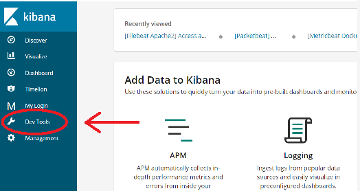

# Using cURL to Interact With Your Vizion-ELK API
Elasticsearch operates as a REST API and be interfaced with any number of tools that make http requests. For this guide,
we will use cURL, available in the Mac or Linux console, to illustrate some basic commands. An even easier way to practice is to open up Kibana and use 'Dev Tools' which can be found on the left navigation bar.



Note that this guide represents a small
fraction of Elasticsearch's capabilities. Much more can be found in [the official docs](https://www.elastic.co/guide/en/elasticsearch/reference/current/docs.html).

## Creating a new index
In Elasticsearch, an index is a set of related data, similar to a 'database' in relational databases. For example, one might have a *product* index or an *employees* index.

````
curl -XPUT '< Your Elasticsearch URL >/< Index name >'
````
*you may choose to use -k before the address so as not to need ssl certificates*

## Creating a document
A 'document' is the Elasticsearch equivalent of a 'row' in relational databases. It is represented as a JSON object of fields and values. ES automatically supports a wide array of datatypes, including strings, numbers, booleans, datetimes, arrays, nested objects. Documents need no schema and can accept whatever fields are assigned.

Here we will create a document in an index called 'person', an index which did not previously exist. No problem, Elasticsearch automatically creates it!

````
curl -XPUT '< Your Elasticsearch URL >/person/_doc/1'
'{
  "name": "Josephina Echerson",
  "nickNames": ["Josie Jo", "Raspberry Jo"]
  "bornAt": 601454129,
 }'
 ````
 Now we have an index for person type things, and one document of a person type thing with an "_id" of 1 the "name: "Josephina Echerson".
 
 ## Create many documents with a JSON file
 
 ````
 curl -XPOST '< Your Elasticsearch URL >/< index >' -d <path to data>.json
 ````
 
## Retrieving a document
Retrieving the JSON data for a document is easy with the document id:
 ````
 curl -XPOST '<Your Elasticsearch URL >/< index >/< id > ' -d <path to data>.json
 ````
 But you're probably not using Elasticsearch to look things up by id's. You want to be able to search other content for key words, phrases, and multiple conditions.
 
## Searching an Index
#### Query vs. Filter
Elasticsearch accepts queries in the form of JSON, often with nested layers of specifications. First it must be declared if the search is a query or if it is a filter. The difference between the two is that a query calculates a score for each document based on the relevance to search criteria, then returns a ranked list. A filter merely filter out all documents that don't meet a certain criteria. This is a yes or no proposition, needs no ranking, and thus needs less computation. 
#### The Match Query
Let's check out the most basic query, the match query. The query looks for the provided search term(s) withing the field specified. Notice this query uses the '\_search' endpoint and an optional parameter to specify the index to search in. 
````
curl -XGET "< ES URL >/< index (optional)>/_search" -H 'Content-Type: application/json' -d
'{
  "query": {
    "match": {
      "< field >" : "< search term(s) >" 
    }
  }
}'
````
Note also that if multiple words are used as search terms, they are tokenized and searched as if separate terms. Remember that a query calculates relevance scores for each document in the index and returns the documents with the highest relevance scores. This means that the query will return documents that may only contain some of the search terms you provided and the terms may not appear in the order you specified. To do that, you should use a 'match_phrase' query:

#### Match Phrase
The 'match_phrase' query should be used when searching for multiple words in a specific order, here is an example of searching a field for the phrase 'cool as a cucumber'
````
curl -XGET "< ES URL >/< index >/_search" -H 'Content-Type: application/json' -d
'{
  "query": {
    "match_phrase": {
      "< field >" : "cool as a cucumber" 
    }
  }
}'
````
This will return high scores for documents that have this whole phrase, and not for just having the word 'cucumber' in it.

#### Range Queries
Elasticsearch allows you to search for documents where number and date data types fall within specified ranges. For this, use a 'range' query, specify the field we want to search and then pass an object containing the constraints. In this example, I will search for a documents in the 'book' index, that have between 330 and 360 pages (inclusive).
````
curl -XGET "< ES URL >/book/_search" -H 'Content-Type: application/json' -d
'{
  "query": {
    "range": {
      "pages" : {
        "gte": 330,
        "lte": 360
      }
    }
  }
}'
````
As you see, we used an object to specify the range to search for within in the 'pages' field. We used 'gte' to specify 'greater than or equal to', 'lte' for 'less than or equal to', but could have also used 'gt' or 'lt' for exclusive ranges.

#### Wildcard/Regex Queries
Elasticsearch has built-in capabilities for wildcard searches. SImply specify if you are doing a wildcard search and use a '?' to represent any one character or '\*' to represent any number of characters. For example 'the?' would match 'they, them, then, etc.' and in the example below, we will be searching an index of patients for anyone who has a condition that encs in 'phobia'.
````
curl -XGET "< ES URL >/patient/_search" -H 'Content-Type: application/json' -d
'{
  "query": {
    "wildcard": {
      "condition" : "*phobia"
      }
    }
  }
}'
````
You have even more capabilities by using the Regex search. Here we will search for a book whose title begins with one or more numerals.
````
curl -XGET "< ES URL >/book/_search" -H 'Content-Type: application/json' -d
'{
  "query": {
    "regex": {
      "title" : "^[0-9]+"
      }
    }ent 
  }
}'
````
Note: Wildcards and regex searches can require a lot of computation. Be careful hasot to make them too general (such as a '\*' wildcard after only a couple of letters) or else your searches can become very very slow.

## Compund Queries
Elasticsearch supports compound queries, which allow a higher level of flexibility and complexity within your searches. The 'bool' query allows you to serch for documents that satisfy a combination of requirements. For example, the following will search for a document in the 'book' index that has the term "voice" in the 'title' field, but does not contain the phrase "coming of age" in the 'description' field.


## Sorting and Aggregating Results
